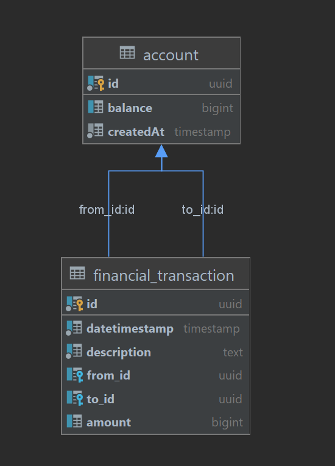
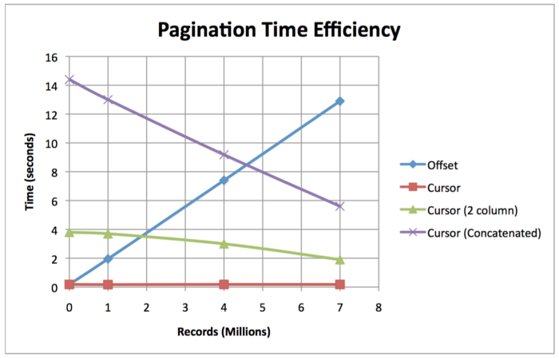
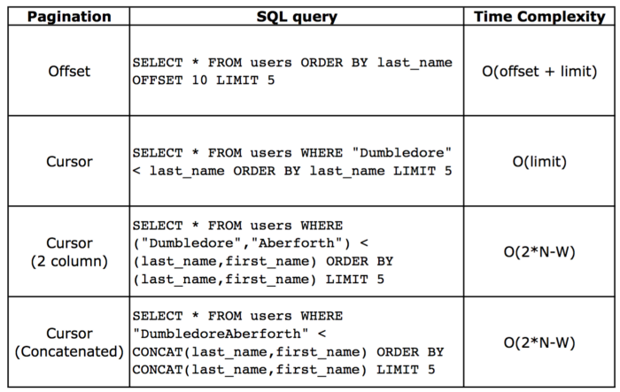
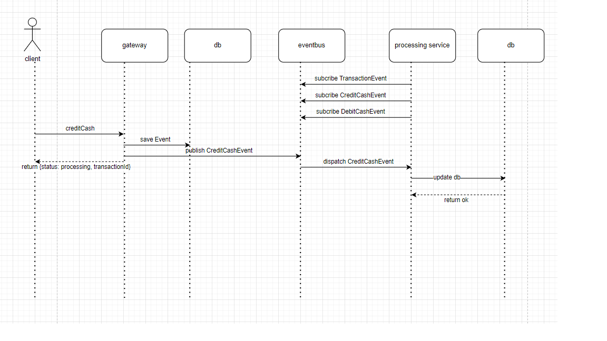
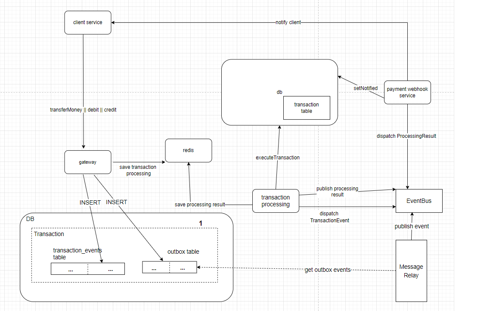

### Requirements
[make](https://www.gnu.org/software/make/), [docker](https://www.docker.com/), [docker-compose](https://docs.docker.com/compose/install/)


#### optional
[golangci-lint](https://github.com/golangci/golangci-lint),
[apache benchmark](https://httpd.apache.org/docs/2.4/programs/ab.html),
[newman](https://www.npmjs.com/package/newman),
[go-cleanarch](https://github.com/roblaszczak/go-cleanarch)

setup data
create table from file ```data\postgres\migrations\init.sql```
insert data from file ```data\postgres\migrations\payment_public_account.sql```
```shell
make bin/money
make up
```

server running on ```localhost:8000```
swagger ui running on ``` localhost:80```

## DB uml




### Пагинация при сортировке по дате реализована через курсор для оптимизации OFFSET операции

Пользователь редко смотрит всю историю транзакций при сортировке по какому-либо полу.
Поэтому можно сохранить данные для пользователей и обновлять при фин. транзакциях.





### Возможная архитектура для улучшения


